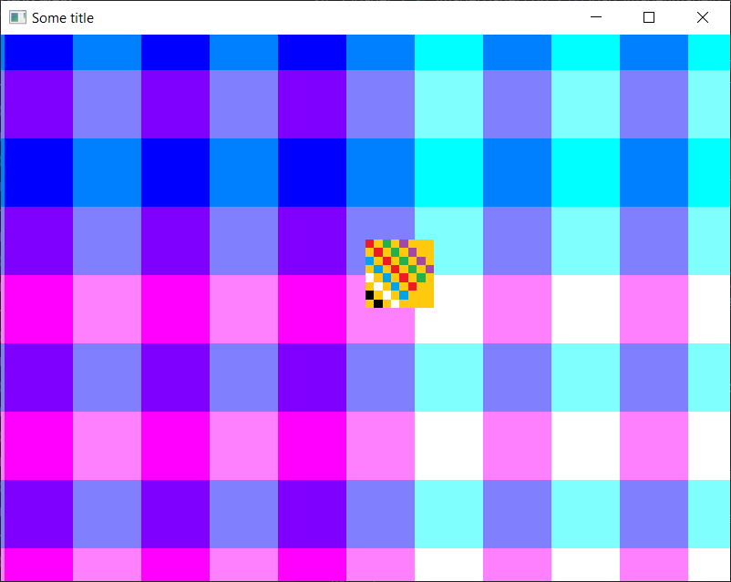

# Some 2D game engine

## Recent state
The most recent screenshot

    

## Changelog

- 22.03.2023: Entity-Component-System introduction
- 23.03.2023: Colored tiles rendering
- 25.03.2023: Textured tiles rendering

## Resources

Texture loading/rendering:
- https://docs.gl/es2/glTexImage2D
- https://learnopengl.com/Getting-started/Textures
- https://doc.magnum.graphics/magnum/examples-texturedquad.html
- https://learnopengl.com/Getting-started/Hello-Triangle