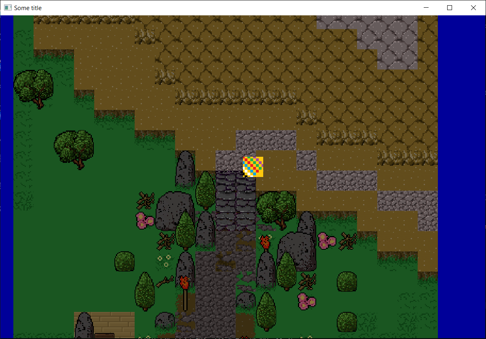

# GWorld - some 2D game

Another attempt to create my dream game. Long jurney starting from 2012 C++ & Allegro, 2016 Java & LWJGL, 2022 Python & PyGame, C as CLI textgame, C++ & SDL and finally back to C++ & GLFW in 2023. Hope it will the final approach. So far it seems :)

[Java & LWJGL](https://github.com/Gieneq/GQuarter) was my first approach to gamedev. 2 years of gamedev mosly learning OOP. As a result blob of some 3D effects. [Python game](https://github.com/Gieneq/LochPythonRPG) was quite a success - it had some fancy design ideas, but it was lacking power of C++ and GPU stuff. [C text game](https://github.com/Gieneq/GLore) was at first very satisfying but at some point adding text parsing was hard to maintain and there was no use of true power of this language.

## Recent state

World start to look like game. There was added loading of map files with resources for tilesets and textures. Player can move freely around the world without any interaction. Component system and existing tile data are ready for collion detection.

    

## Changelog

- 22.03.2023: Entity-Component-System introduction
- 23.03.2023: Colored tiles rendering
- 25.03.2023: Textured tiles rendering
- 07.08.2023: Map TMX & Tileset TSX files loading and rendering
- 08.08.2023: Tiles animation with common timing listeners

## Dependencies:
- https://github.com/glfw/glfw
- https://github.com/lvandeve/lodepng
- https://rapidxml.sourceforge.net/
- https://github.com/zeux/pugixml

## Resources
Get started:
- https://www.glfw.org/documentation.html

Texture loading/rendering:
- https://docs.gl/es2/glTexImage2D
- https://learnopengl.com/Getting-started/Textures
- https://doc.magnum.graphics/magnum/examples-texturedquad.html
- https://learnopengl.com/Getting-started/Hello-Triangle

Setup GLAD:
- https://learnopengl.com/Getting-started/Creating-a-window
- https://glad.dav1d.de/

## How to setup environment

Comming soon...

## Ideas
- Update, render batches